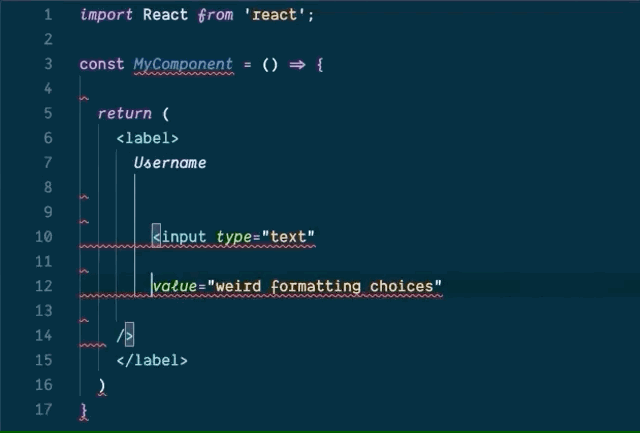

If you’ve spent any amount of time configuring ESLint — the most widely used linting tool for JavaScript — you’ll know you can easily get lost in it.

But there are also formatters like Prettier, which are excellent but often fight with linters.

I strongly believe that a solid linting setup con save you tons of time and catch many bugs much sooner. The first time you save a file and it auto-formats like this, you'll see how powerful it is:



After much trial and error, I’ve put together and setup I use for every project and published it for easier use.

# 1. Set Up Your Project

Make a new directory for your linting config and run either `yarn init -y` or `npm init -y` to create a `package.json`.

When publishing an ESLint config, all we need to export is an ESLint config object.

So let's make an `index.js` file with the following content:

```js
module.exports = {

}
```

And then install ES Lint:

```bash
yarn add eslint
# or
npm install --save eslint
```

# 2. Find a setup to use as a base

Instead of hand-picking every linter rule, I would strongly suggest finding an existing config and [extending it.](https://eslint.org/docs/user-guide/configuring#extending-configuration-files)

I would strongly recommend using React's official [eslint-config-react-app](https://github.com/facebook/create-react-app/tree/master/packages/eslint-config-react-app#usage-outside-of-create-react-app), but if you want to find more options you can check out [this repo.](https://github.com/dustinspecker/awesome-eslint).

For many years, I was a strong advocate for the AirBNB linting config, but recently I realized I'd been turning off many of their opinionated rules.

I finally removed it after reading [Dan Abramov’s](https://overreacted.io/writing-resilient-components/#marie-kondo-your-lint-config) advice on the topic:

> Don’t assume that whatever you or something somebody else added to your lint config a year ago is a “best practice”. Question it and look for answers. Don’t let anyone tell you you’re not smart enough to pick your lint rules.

If you do prefer more rules, then more power to you! But if you find they're getting in your way and not helping catch bugs, it might be time to part ways.

In case you do go with a different config (and you use React), make sure to include this [jsx accessibility](https://github.com/evcohen/eslint-plugin-jsx-a11y) plugin. Even if your primary focus isn't accessibility, I believe every project should have this by default even if it the rules seem frustrating at first.

Once you have your base, update your `index.js`:

```js
module.exports = {
  extends: ['react-app'] // or whatever you chose as your base config
}
```

# 3. Add Your Formatter

Now that we have our linter set up to catch code-related bugs, we're going to use [Prettier](https://prettier.io/) to consistently format our code.

First add these packages:
```bash
yarn add prettier eslint-config-prettier eslint-plugin-prettier
# or
npm install --save prettier eslint-config-prettier eslint-plugin-prettier
```

Here's what we've added:
- `prettier` - Used to run the formatting
- `eslint-config-prettier` - Turns off ESLint formatting rules that would conflict with Prettier
- `eslint-plugin-prettier` - Allows your ESLint config to run prettier

While the setup is a bit cumbersome, this will allow you to _just_ use ESLint to lint and format your code and keep you from having to use Prettier separately.

Now, update your `index.js` again:

```js
module.exports = {
  extends: [
    'react-app', // or whatever you chose as your base config
    'plugin:prettier/recommended', // this will stop Prettier and ESLint from fighting over fixes
    'prettier/react', // optionally include this if you use React
  ],
  'plugins': ['prettier'],
  'rules': {
    // make Prettier return errors
    'prettier/prettier': [
      'error',
      {
        // Optional Prettier config changes
        trailingComma: 'es5',
        singleQuote: true,
        printWidth: 80,
      },
    ],
  }
}
```

# 4. Publishing

To publish this config, you'll need to update a few things in your `package.json`:

```js
{
  // must start with "eslint-config" for other people to include it
  "name": "eslint-config-my-cool-config",
  // this must be increased every time you publish
  "version": "1.0.0",
  // this tells node where to find the main module when it's installed
  "main": "index.js",
}
```

Then, make sure you have an account with [NPM](https://www.npmjs.com) and follow their guide to [publish a package](https://docs.npmjs.com/creating-and-publishing-unscoped-public-packages#publishing-unscoped-public-packages).

Once it's successful, you should be able to go to any Javascript project using NPM and run:

```bash
yarn add eslint-config-my-cool-config
# or
npm install --save eslint-config-my-cool-config
```

And then extend your own config by making a `.eslintrc` file in the root of your project:

```js
{
  // don't include the `eslint-config-` part when extending
  "extends": ["my-cool-config"]
}
```

# 5. Super Charge Your Text Editor

If you aren't sold on the benefits of all this setup yet, this is where you'll start to see how helpful this is.

Your text editor should have an official [ESLint integration](https://eslint.org/docs/user-guide/integrations#editors), but for this example we're going to set it up in VS Code.

Install the [VSCode ESLint extension](https://marketplace.visualstudio.com/items?itemName=dbaeumer.vscode-eslint) and then open the command pallette (`cmd / ctrl + shift + p`) and type `settings json` and select `Open Settings (JSON)`.

At the end of the settings JSON, add this:

```js
"editor.codeActionsOnSave": {
    "source.fixAll.eslint": true
},
```

Now when you save a file it should automatically run eslint fixes, which also include our Prettier formatting and save you hours of headache in the future.

Finally, don't forget that if you end up changing your mind about any rules, you can always override them in your `.eslintrc` project's config file:

```js
{
  // don't include the `eslint-config-` part when extending
  "extends": ["my-cool-config"],
  "rules": {
    // 0 turns the rule off, 1 emits a console warning and 2 throws an error
    "overly-opinionated-rule": 0
  }
}
```

Or change them in your custom config package (just remember you'll have to publish it afterward):

```js
{
  "extends": ["base-config"],
  "rules": {
    "overly-opinionated-rule": 0
  }
}
```